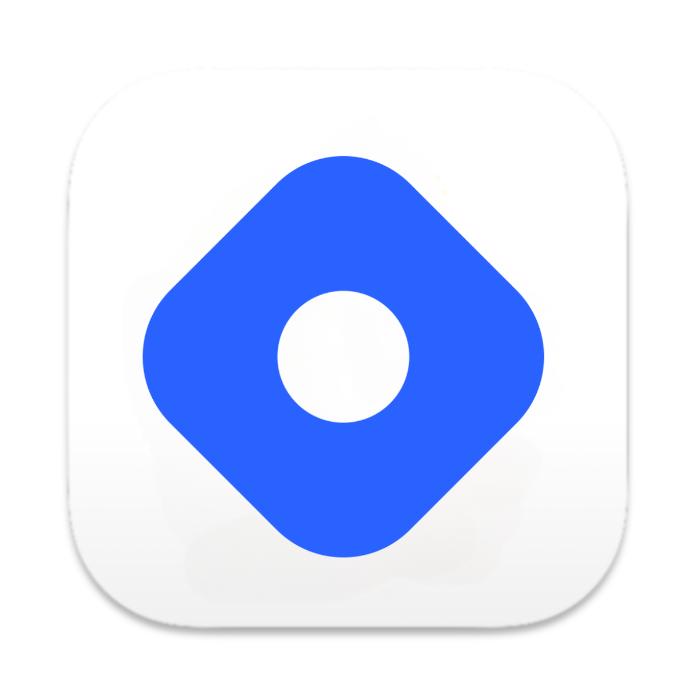

# I'm [Mantresh](https://www.mantreshkhurana.com)  

I am a full-stack developer with more than 7+ years of experience working on projects in a variety of industries. Since I first used a computer, I have been interested in technology. I began using Windows OS before switching to Ubuntu and then to macOS(I started loving UNIX), which marked the beginning of a lifelong quest for technological harmony, haha lol.

- 📝 &nbsp;You can find my resume [here](https://www.mantreshkhurana.com/resume).
- 🔭 &nbsp;Currently working for [Spyxpo](https://www.spyxpo.com).
- 👨‍🎓 &nbsp;Pursuing my B.Tech in CSE.
- 📫 &nbsp;You can contact me [here](https://www.mantreshkhurana.com/contact).

#

📊 &nbsp;Github Metrics

 

🛠️ &nbsp;Tools & Frameworks

 

> These are some of the tools and frameworks that I have worked with. My expertise includes working on web, mobile, desktop, and embedded systems. I have utilized a wide range of technologies, including Python, Rust, C, C++, Java, JavaScript, HTML, CSS, React, React Native, Electron, Node.js, GCP, MongoDB, MySQL, Flutter, Shell Scripting, Git, Docker, UE5, AWS, Unity, Fusion 360, Blender, EAGLE, easyEDA, Arduino, Raspberry Pi, ESP32, ESP8266, STM32, among others.

🖥️ &nbsp;Github Stats

 

🔥 &nbsp;Github Streak

 

ℹ️ &nbsp;More Info

 

> Note: My contributions are not limited to the repositories mentioned below. I have been contributing to private repositories as well, which I cannot disclose here. My contributions are for both personal and professional projects where [Spyxpo](https://www.spyxpo.com) is one of them, I have been working on it for more than 7 years now. Check my [resume](https://www.mantreshkhurana.com/resume) for more info.

